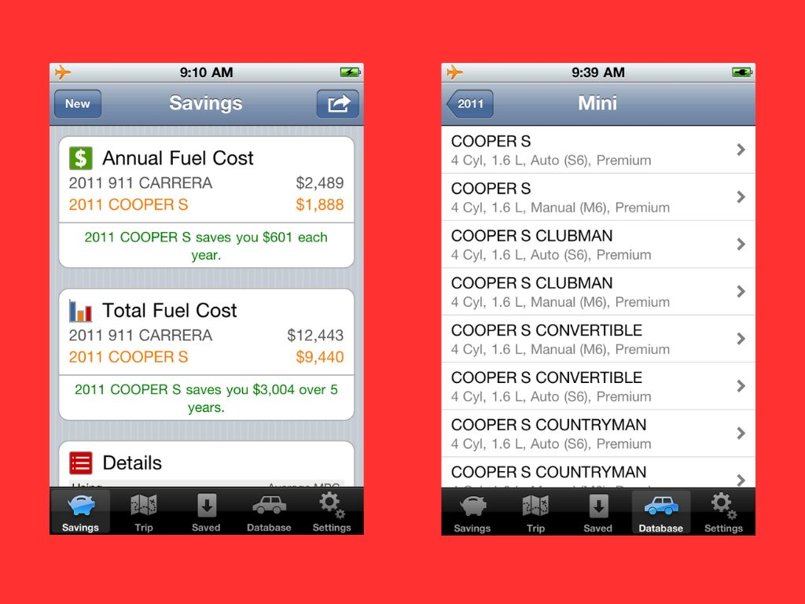

# Fuel Savings Calculator

A comprehensive iOS application for comparing fuel costs between vehicles and calculating trip-specific fuel expenses. Originally developed in 2011 for iOS 5+.

## Overview

Fuel Savings Calculator helps users make informed vehicle purchasing decisions by providing detailed fuel cost comparisons and projections. The app goes beyond simple fuel calculators by offering side-by-side vehicle comparisons, real EPA fuel efficiency data, and long-term financial analysis.

## Key Features

- **Vehicle Comparison**: Compare fuel costs between up to 2 vehicles with annual and total ownership projections
- **Flexible Efficiency Modes**: Choose between average MPG or detailed city/highway driving patterns
- **Trip Calculator**: Calculate fuel costs for individual journeys  
- **Vehicle Database**: Browse real EPA fuel efficiency ratings organized by year, make, and model
- **Saved Calculations**: Store and manage multiple fuel savings calculations
- **Multi-region Support**: US and Puerto Rico with appropriate unit conversions
- **Customizable Parameters**: Adjust driving patterns, ownership periods, and fuel prices

## What It Calculates

The app performs comprehensive fuel cost analysis including:

- Annual fuel costs using the formula: `(fuel_price × annual_distance) ÷ fuel_efficiency`
- Total ownership costs over multiple years
- Cost differences between vehicles showing potential savings
- Weighted calculations for mixed city/highway driving
- Trip-specific fuel expenses

## Use Cases

- **Car Shopping**: Compare fuel costs between different vehicles before purchase
- **Financial Planning**: Calculate long-term fuel expenses for budgeting
- **Trade-in Analysis**: Determine if upgrading to a more efficient vehicle saves money
- **Trip Planning**: Calculate fuel costs for specific journeys

## Technical Details

**Architecture:**
- Legacy iOS application written in Objective-C (iOS 5 era)
- Core Data persistence with SQLite backend for vehicle database
- Tab-based navigation with modal input controllers
- Manual reference counting (pre-ARC)

**Core Components:**
- `RLCoreDataObject`: Core Data wrapper providing managed object context and store coordinator
- `MPGDatabaseInfo`: Core Data entity for storing EPA vehicle efficiency data
- `FuelSavingsViewController`: Primary controller for fuel savings calculations
- `Savings`, `Vehicle`, `Trip`: Data models for calculations and user data
- Unit conversion utilities (`NSNumber+Units`) and helper categories

**Key Calculations:**
- Annual fuel cost: `(fuel_price × annual_distance) ÷ fuel_efficiency`
- Weighted calculations for mixed city/highway driving patterns
- Multi-year ownership cost projections
- Vehicle comparison analysis showing cost differences

**Database:**
- Pre-populated SQLite database (`MPGDatabase.sqlite`) with real EPA vehicle data
- Comprehensive vehicle specifications: year, make, model, city/highway/average MPG
- Additional metadata: engine details, transmission, size class

## Status

This project is archived and represents iOS development practices from 2011. It demonstrates pre-ARC Objective-C development, Core Data usage, and comprehensive fuel efficiency calculations in a mobile application context.